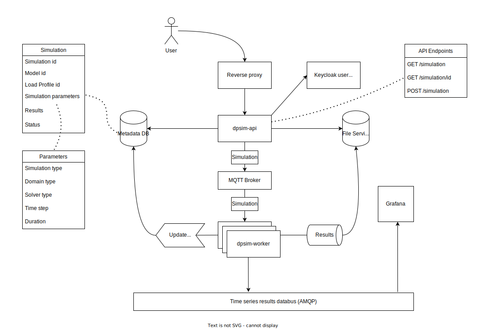

# Simulation Demo

This folder is for testing the [dpsim-api](https://github.com/sogno-platform/dpsim-api) and [dpsim-worker](github.com/sogno-platform/dpsim-worker) projects. You do not need to download those projects just to run the demo.

This project depends upon a kubernetes installation and is tested on minikube. It also depends upon helm to tell kubernetes where to find the containers that it needs to run. Installation instructions for these dependencies can be found at the project sites:

[Installing Minikube](https://minikube.sigs.k8s.io/docs/start/)

[Installing Helm](https://helm.sh/docs/intro/install/)

Now that you have installed all of the external dependencies, you can install the sogno helm charts:

```bash
$ helm repo add sogno https://sogno-platform.github.io/helm-charts
```

### The components used in this demo




### Running the demo

A detailed run-down of the simulation demo is available [here](RUN.md)

## Notes

- security issues (this is only a demo):
  - using HTTP instead of HTTPS
  - example passwords in yaml files
