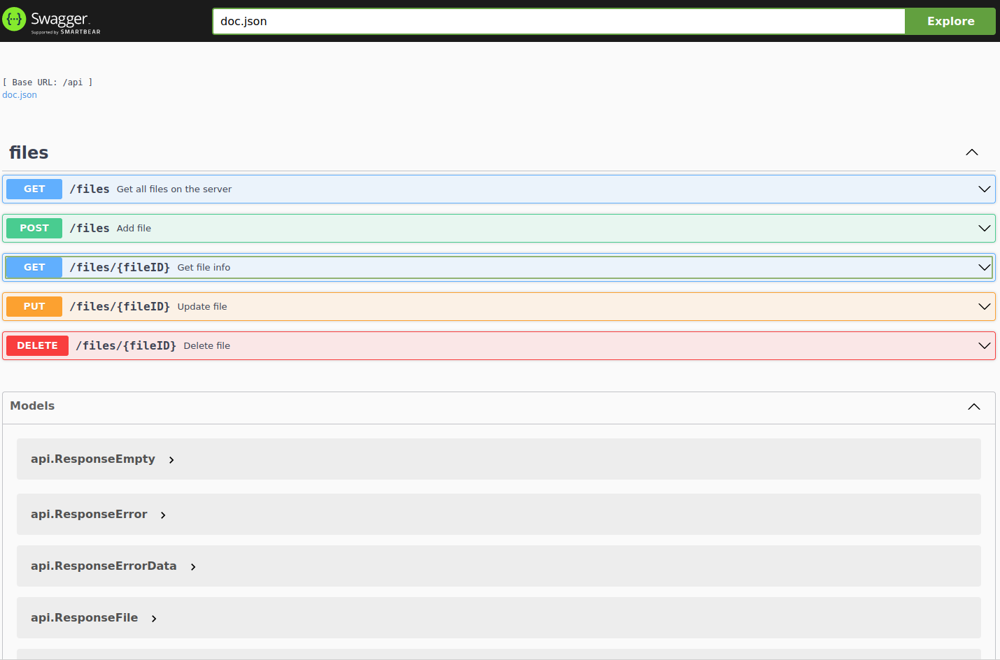
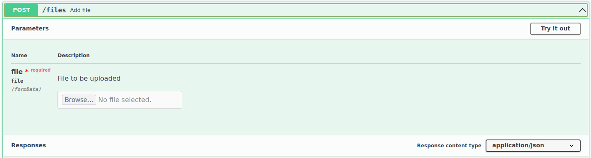
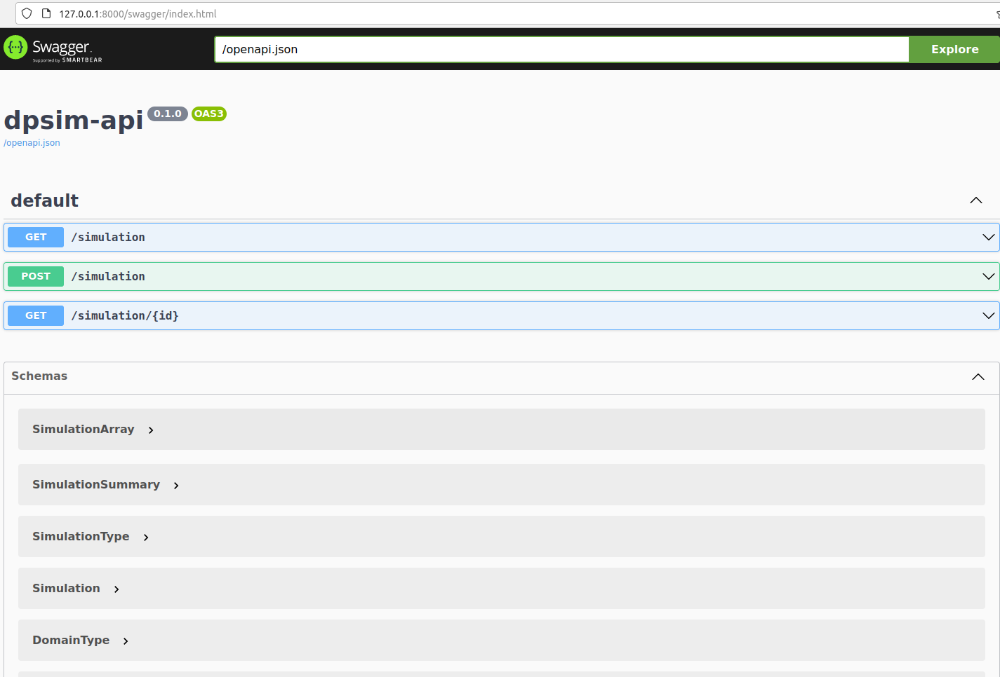
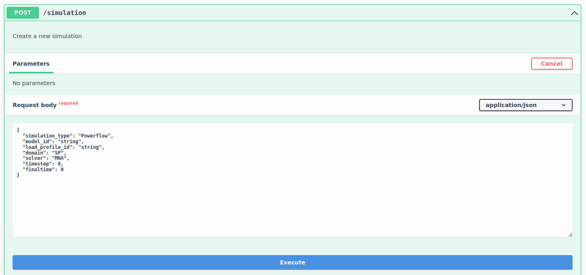
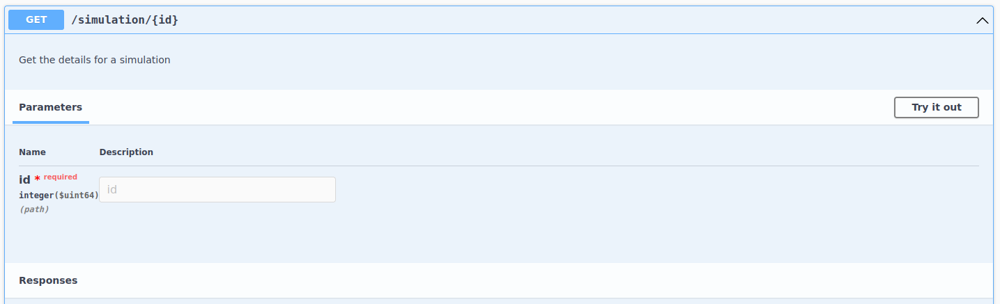

#### How to access the swagger UI

There are two swagger UIs relevant to this demo. They are the api UI and the file server UI. The swagger UI is not forwarded by default. To access them you need to run two scripts. They will forward requests on your local machine to the services for the swagger UI.

```bash
$ ./scripts/api_port_forward.sh
$ ./scripts/file_port_forward.sh
```

After the port forwarding has begun, you can access the UIs at the following addresses:

| Service | Address                                   |
| ------- | ----------------------------------------- |
| API     | http://127.0.0.1:8000/swagger/index.html  |
| FILE    | http://127.0.0.1:8080/api/docs/index.html |


### The file swagger UI

The file api swagger UI looks like this:


The one that you will need to start a simulation is this one here:

You will need to upload the model data (as a CIM ZIP file) and note down the file ID.

### The dpsim api swagger UI

The dpsim api swagger UI looks like this:


The endpoint you will need to start a simulation is this one:

You will need to post a simulation, using the model id from the previous step, and note down the simulation ID.

The endpoint you will need for getting the results is this one:


